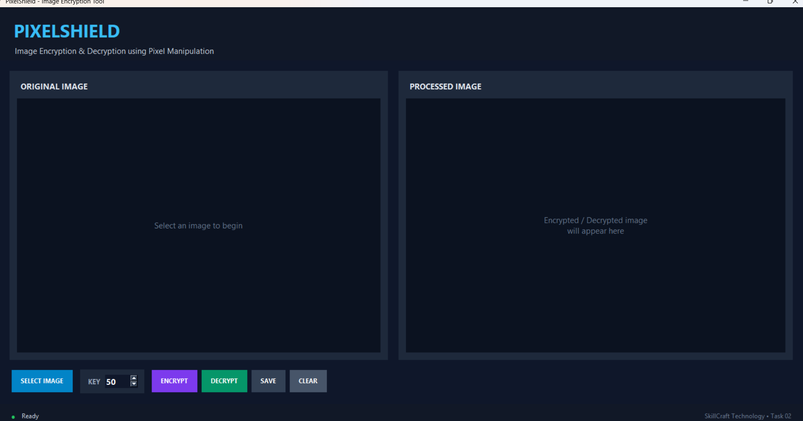
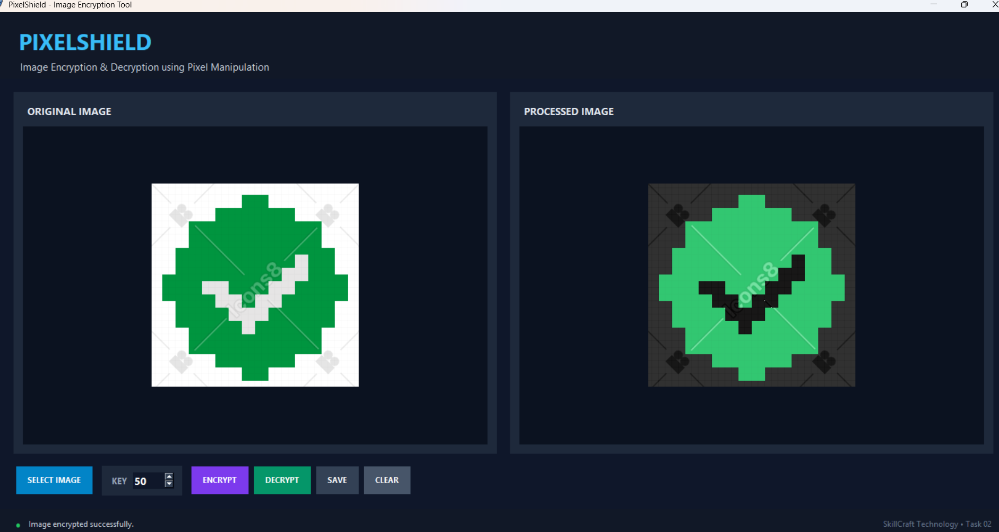
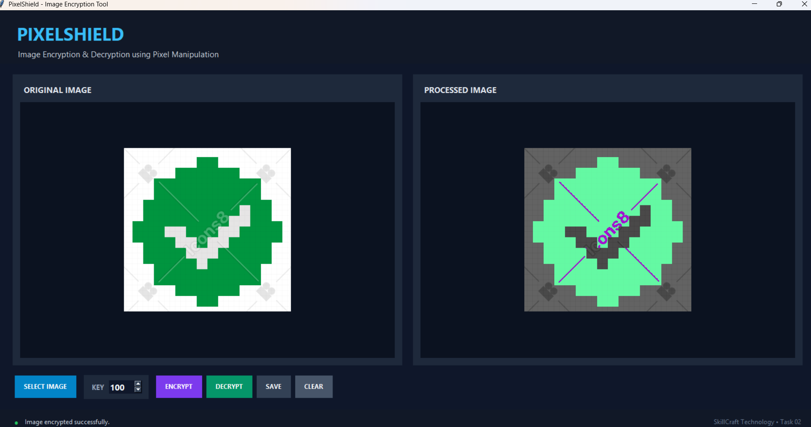
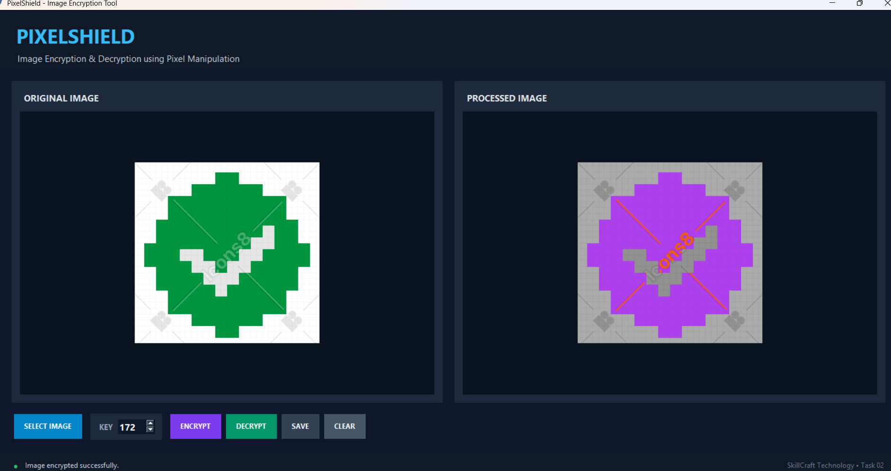
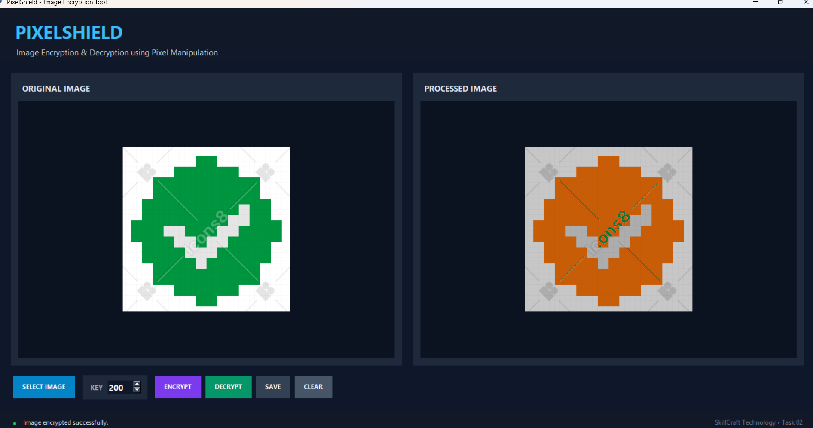
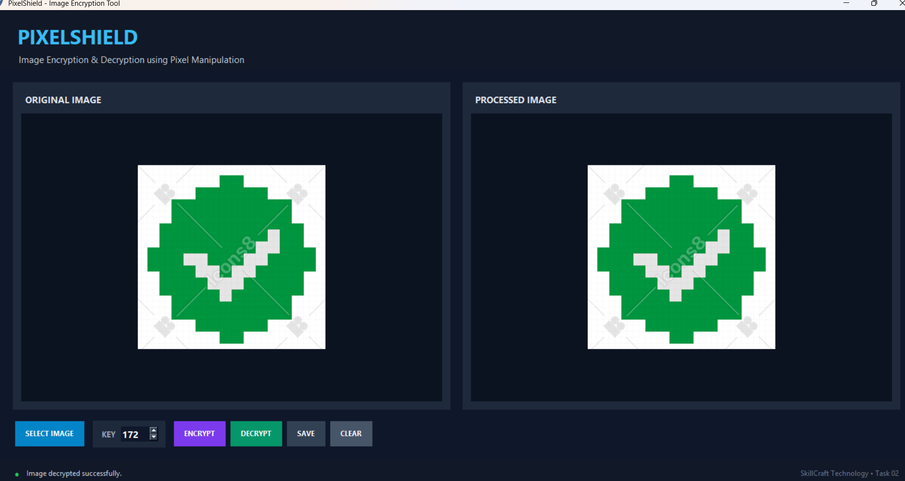

# PixelShield - Image Encryption Tool

A GUI-based image encryption and decryption application developed using Python and Tkinter. The application performs pixel manipulation using a user-defined key to demonstrate a simple image encryption technique.

## Task

**SkillCraft Technology Internship - Cyber Security Task 02**

## Objective

Develop a simple image encryption tool using pixel manipulation by applying a basic mathematical operation to the pixel values of an image.

## Features

- Select PNG, JPG, JPEG, and BMP images
- Encrypt images using pixel manipulation
- Decrypt encrypted images
- User-defined encryption key
- Preview original and processed images
- Save processed images
- Clear and reset the application
- User-friendly graphical interface
- Status messages for application operations

## Technologies Used

- Python 3
- Tkinter
- Pillow (PIL)
- Pixel Manipulation
- Basic Mathematical Operations

## How It Works

The application reads the RGB values of every pixel in the selected image.

Each pixel contains three color components:

```text
R = Red
G = Green
B = Blue
```

Each RGB component has a value between `0` and `255`.

### Encryption

For each pixel, the selected key is added to the Red, Green, and Blue values.

```text
Encrypted Pixel = (Original Pixel + Key) % 256
```

For example, if a pixel has the following RGB values:

```text
R = 100
G = 150
B = 200
```

and the selected key is `50`:

```text
R = (100 + 50) % 256 = 150
G = (150 + 50) % 256 = 200
B = (200 + 50) % 256 = 250
```

Therefore, the encrypted pixel becomes:

```text
(150, 200, 250)
```

### Decryption

During decryption, the same key is subtracted from the encrypted pixel values.

```text
Decrypted Pixel = (Encrypted Pixel - Key) % 256
```

Using the encrypted pixel `(150, 200, 250)` and key `50`:

```text
R = (150 - 50) % 256 = 100
G = (200 - 50) % 256 = 150
B = (250 - 50) % 256 = 200
```

The original pixel values are recovered:

```text
(100, 150, 200)
```

### Why Modulo 256?

RGB values must always remain between `0` and `255`.

The modulo operation `% 256` keeps the resulting pixel values within this valid range.

For example:

```text
230 + 50 = 280

280 % 256 = 24
```

Therefore, the resulting RGB value becomes `24`.

## Application Workflow

```text
Select Image
      ↓
Enter Encryption Key
      ↓
Encrypt Image
      ↓
Pixel Values Modified
      ↓
Save Processed Image
      ↓
Decrypt Using Same Key
      ↓
Original Pixel Values Recovered
```

## How to Run

### 1. Install Python

Make sure Python 3 is installed on your computer.

Check the Python installation using:

```bash
python --version
```

### 2. Install Pillow

Open the VS Code terminal and run:

```bash
pip install pillow
```

### 3. Open the Project

Open the project folder in Visual Studio Code.

### 4. Run the Application

Open the VS Code terminal and execute:

```bash
python image_encryption.py
```

The PixelShield application will open.

## How to Use

### Step 1 - Select an Image

Click the **SELECT IMAGE** button and choose a PNG, JPG, JPEG, or BMP image.

### Step 2 - Enter the Key

Enter an encryption key between `1` and `255`.

For example:

```text
Key = 50
```

### Step 3 - Encrypt the Image

Click the **ENCRYPT** button.

The application modifies the RGB values of every pixel using the selected key.

### Step 4 - Decrypt the Image

Click the **DECRYPT** button using the same key.

The application subtracts the key from the encrypted RGB values and restores the original pixel values.

### Step 5 - Save the Image

Click the **SAVE** button to save the processed image to your computer.

### Step 6 - Clear the Application

Click the **CLEAR** button to reset the application and start again.

## Screenshots

### Original Image



### Encryption Demo - Step 1



### Encryption Demo - Step 2



### Encryption Demo - Step 3



### Encryption Demo - Step 4



### Decryption Demo



## Project Structure

```text
SCT_CS_02/
├── image_encryption.py
├── README.md
├── pixel_encryption_test.png
├── 01_original_image.png
├── 02_encryption-01_demo.png
├── 02_encryption-02_demo.png
├── 02_encryption-03_demo.png
├── 02_encryption-04_demo.png
└── 03_decryption_demo.png
```

## Key Concepts Demonstrated

### Pixel Manipulation

An image consists of pixels, and each pixel contains RGB color values. The application directly modifies these values to demonstrate a simple image encryption technique.

### RGB Color Model

Each pixel is represented using three color components:

```text
Red   → 0 to 255
Green → 0 to 255
Blue  → 0 to 255
```

### Reversible Transformation

The encryption operation adds the selected key:

```text
(Original Pixel + Key) % 256
```

The decryption operation subtracts the same key:

```text
(Encrypted Pixel - Key) % 256
```

Using the same key allows the original pixel values to be recovered.

## Learning Outcomes

Through this project, I gained practical experience in:

- Python programming
- Tkinter GUI development
- Image processing using Pillow
- RGB color representation
- Pixel-level manipulation
- Basic image encryption concepts
- Encryption and decryption logic
- Modular arithmetic
- File handling
- Building a user-friendly desktop application

## Future Improvements

Possible improvements for a more advanced version include:

- Stronger image encryption algorithms
- Password-based key generation
- Randomized encryption keys
- Support for additional image formats
- Image comparison after decryption
- Progress indicator for large images
- Improved error handling
- Secure cryptographic algorithms for real-world applications

## Internship Information

**Organization:** SkillCraft Technology  
**Internship Role:** Cyber Security Intern  
**Task:** Task 02 - Image Encryption Tool  
**Technology:** Python  
**Project:** PixelShield

## Note

This project demonstrates a simple educational image encryption technique based on pixel manipulation and modular arithmetic.

It is intended for learning and demonstration purposes and should **not** be considered a secure modern image encryption system for protecting sensitive or confidential information.
